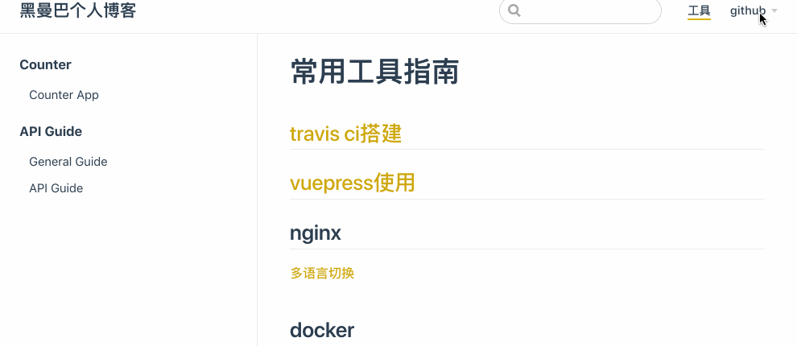

### 导航栏和侧栏



```
module.exports = {
    themeConfig:{
        nav: [ // 导航栏
            { text: '工具', link: '/tools/' },
            {
                text: 'github',
                // 这里是下拉列表展现形式。
                items: [
                    {   
                        text: 'focus-outside', 
                        link: 'https://github.com/TaoXuSheng/focus-outside' 
                    },
                    {   
                        text: 'stylus-converter', 
                        link: 'https://github.com/TaoXuSheng/stylus-converter' 
                    },
                ]
            }
        ],
        sidebar: [ // 侧栏
            {
              title: 'Counter',
              collapsable: false,
              children: [
                '/counter/counter-app'
              ]
            },
            {
              title: 'API Guide',
              collapsable: false,
              children: [
                  '/tools/guide',
                  '/tools/api'
              ]
            }
        ]
    }
}
```


### 在VuePress中注册组件

1. 自定义组件
在.vuepress/components中增加组件 my-header.vue
```
<template>
  <div>
      <h1>This Header is actually a Vue Template</h1>
  </div>
</template>
<script>
    
</script>
<style scoped>
</style>
```
无需手动引用直接在md文件中使用组件即可`<my-header></my-header>`

2. 引用组件库
假设我需要做代码演示(引用了第三方库),这时候我们通常统一的注册。在.vuepress/enhanceApp.js来配置。
下面我们引入element-ui组件库。
```
// 全局注册 Element 组件库
import Vue from 'vue'
import Element from 'element-ui'
import 'element-ui/lib/theme-chalk/index.css'

export default ({
  Vue,
  options,
  router
}) => {
  Vue.use(Element)
}
```
